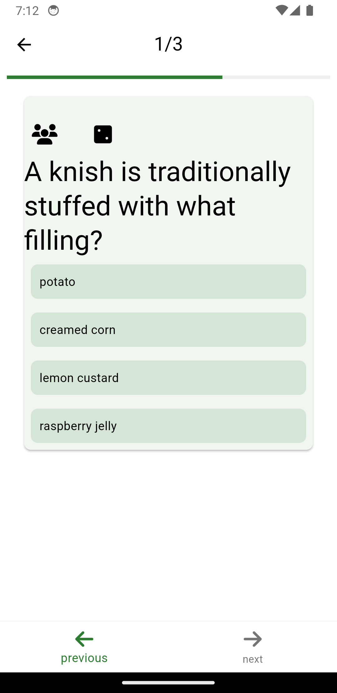

# Think Tank

Welcome to Think Tank, your ultimate companion for unleashing the power of quizzes and contests! Dive into the world of knowledge exploration with our Flutter application, meticulously crafted to elevate your experience in creating, managing, and participating in captivating multiple-choice question (MCQ) challenges.

With Think Tank, the possibilities are endless. Seamlessly create MCQs, infusing them with rich attachments like video snippets, audio clips, or even insightful PDF documents. Tag your questions for easy organization and unleash your creativity in crafting diverse contests that engage and inspire.

Track your progress and challenge your peers as you navigate through contests, all while our intuitive interface ensures a smooth and immersive experience. Think Tank isn't just an app; it's a gateway to learning, collaboration, and fun.

Embark on your journey of intellectual discovery with Think Tank today!
## Features

- Display a list of questions and contests
- CRUD operations for tags, contests, and questions
- Attachments can be added to questions
- View detailed question information
- Favorite questions functionality
- View favorite questions list
- Theme switcher for the app
- Responsive design for different screen sizes
- Internationalization for multiple languages (English, Arabic, Deutsche, and Japanese)

## Architecture and Design Patterns Used

- **Clean Architecture**: Separation of concerns and layers for maintainability.
- **BLoC (Business Logic Component) Pattern**: Managing the application's state and business logic.
- **Repository Pattern**: Abstraction layer between the data sources and the rest of the app.
- **Dependency Injection**: Utilized for managing object creation and providing dependencies.
- **Singleton Pattern**: Ensures a single instance of a class is created.
- **Factory Pattern**: Used for creating objects without specifying the exact class.

## SOLID Principles Applied

The SOLID principles (Single Responsibility, Open/Closed, Liskov Substitution, Interface Segregation, and Dependency Inversion) have been applied throughout the development of Think Tank to ensure a robust and maintainable codebase.

## Technologies Used

- **dartz**: Functional programming in Dart.
- **flutter_bloc**: State management library for Flutter applications.
- **bloc**: Implementing the BLoC pattern.
- **shared_preferences**: Caching requests for improved performance.
- **equatable**: Ensuring value equality for Dart objects.
- **get_it**: Dependency injection library for managing object creation.
- **intl**: Internationalization for supporting multiple languages.
- **flex_color_scheme**: App theme switcher for a personalized user experience.
- **adaptive_theme**: App mode switcher for light and dark themes.
- **setting_ui**: Library for implementing app settings with ease.
- **uuid**: Generating unique identifiers for objects.
- **font_awesome_flutter**: Icon pack for Flutter applications.
- **mime**: Determining the MIME type of files.
- **media_kit**: Playing audio and video files in Flutter applications.
- **file_picker**: Selecting files from the device.
- **lottie**: Animation library for Flutter applications.
- **path_provider**: Accessing directories on the device.
- **easy_localization**: Internationalization for Flutter applications.

## Installation and Usage

1. Clone the repository
```bash
git clone
```
2. Install dependencies
```bash
flutter pub get
```
3. Run the app
```bash
flutter run
```

## Screenshots
<!-- screenshots/attachment_manager_create_menu.png  screenshots/create_question_add_tag.png              screenshots/home_page_ligh.png                       screenshots/settings_page.png
screenshots/attachment_manager_filters.png      screenshots/create_question_page.png                 screenshots/home_page_side_menu_arabic_locale.png    screenshots/tag_creator_page.png
screenshots/attachment_manager_page.png         screenshots/create_question_select_answer.png        screenshots/home_page_side_menu_japanese_locale.png  screenshots/tags_manager_page.png
screenshots/contest_page_arabic_locale.png      screenshots/home_page_arabic_local_with_filters.png  screenshots/home_page_side_menu.png                  screenshots/view_contest_details.png
screenshots/create_contest_add_questions.png    screenshots/home_page_contests_page.png              screenshots/run_contest_answer_question-1.png
screenshots/create_contest_page.png             screenshots/home_page_create_menu_arabic_locale.png  screenshots/run_contest_answer_question.png
screenshots/create_question_add_choices.png     screenshots/home_page_create.png                     screenshots/settings_page_dark_mode.png -->

| Home Page | Create Question | Create Contest | View Contest Details |
|:-----------:|:-------------:|:---------------:|:---------------:|
|  |  |  |  |


| Home Page (Arabic Locale) | Home Page (Japanese Locale) | Home Page (Arabic Locale with Filters) | Home Page (Dark Mode) |
|:-----------:|:-------------:|:---------------:|:---------------:|
|  |  |  |  |

| Create Question (Add Tag) | Create Question (Select Answer) | Create Question (Add Choices) | Create Question (Add Attachment) |
|:-----------:|:-------------:|:---------------:|:---------------:|
|  |  |  |  |

| Create Contest (Add Questions) | Contest Page (Arabic Locale) | Run Contest (Answer Question) | Run Contest (Answer Question) |
|:-----------:|:-------------:|:---------------:|:---------------:|
|  |  |  |  |

| Attachment Manager (Create Menu) | Attachment Manager (Filters) | Home Page (Side Menu) | Home Page (Side Menu Arabic Locale) |
|:-----------:|:-------------:|:---------------:|:---------------:|
|  |  |  |  |


| Settings Page | Tag Creator Page | Tags Manager Page | 
|:-----------:|:-------------:|:---------------:|
|  |  |  |

